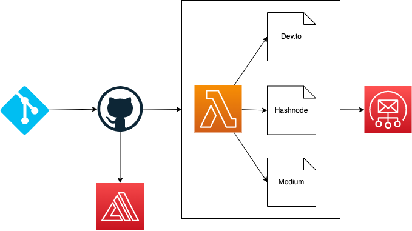

# Focus Otter Cross Post



This can basically be split up into 4 main parts:

1. Getting the markdown file
2. Transforming the markdown file
3. Cross posting to the relevant platforms
4. Sending a notification that the files were cross posted

## Getting the markdown file.

This is trickier than I thought. This involves setting up a GitHub action to fire a lambda function. This Lambda will get the current commit and compare it with the previous commit to see what files have changed.

From here, I should be able to grab the markdown file.

I'm going to create a new directory called `samplePosts` with a test markdown file. Allen gave me one of his blog posts to help me out.

### Creating the Lambda function

The GitHub action isn't actually deploying anything. I just needs to call a Lambda function. I'll do the following steps:

1. Create the lambda function
2. Add a function URL (include a cfnoutput of the URL)
3. Create a github action that calls the function
4. Log out the event of the function
5. Deploy
6. Store the secret in GitHub
7. Test: Commit and Verify

It worked 🎉
I enhanced the action to pass github details as well:

```yml
steps:
  - name: Call endpoint
    run: |
      curl -X POST -H "Content-Type: application/json" \
      -d '{
        "ref": "${{ github.ref }}", 
        "repo": "${{ github.repository }}", 
        "commit": "${{ github.event.after }}"
        }' \
       ${{ secrets.ENDPOINT }}
```
