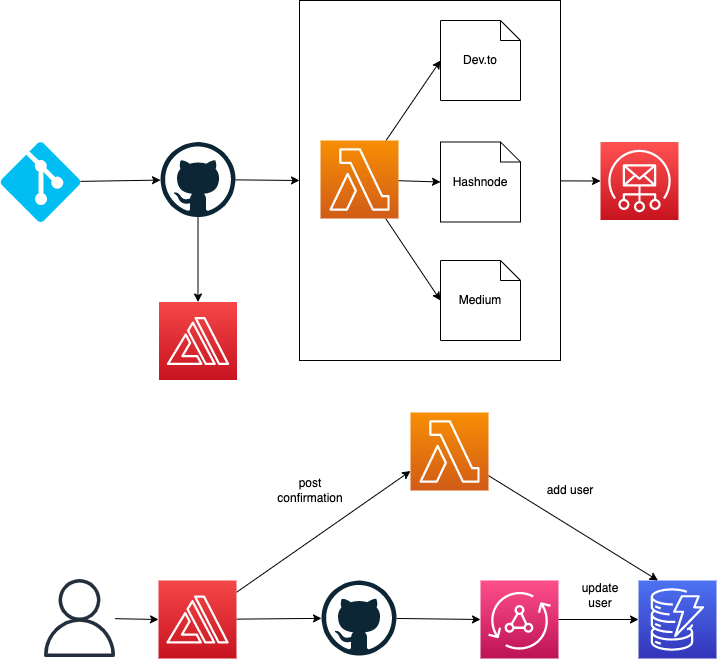

# Focus Otter Cross Post



This can basically be split up into 5 main parts:

0. Calling a Lambda from a GitHub action
1. Getting the markdown file
2. Transforming the markdown file
3. Cross posting to the relevant platforms
4. Sending a notification that the files were cross posted

### Creating the Lambda function

The GitHub action isn't actually deploying anything. I just needs to call a Lambda function. I'll do the following steps:

1. Create the lambda function
2. Add a function URL (include a cfnoutput of the URL)
3. Create a github action that calls the function
4. Log out the event of the function
5. Deploy
6. Store the secret in GitHub
7. Test: Commit and Verify

It worked 🎉
I enhanced the action to pass github details as well:

```yml
steps:
  - name: Call endpoint
    run: |
      curl -X POST -H "Content-Type: application/json" \
      -d '{
        "ref": "${{ github.ref }}", 
        "repo": "${{ github.repository }}", 
        "commit": "${{ github.event.after }}"
        }' \
       ${{ secrets.ENDPOINT }}
```

This produced the following output:

```json
{"body": '{\n' +
    '  "ref": "refs/heads/main", \n' +
    '  "repo": "focusOtter/cross-post-backend", \n' +
    '  "commit": "dedf137e23af6cf98c79357d666231c10b4bb982"\n' +
    '  }',}
```

## Getting the markdown file.

I'm pretty much going to look over Allen's code and compare that with what chatGPT gives me and find somewhere in between that I like.

The Lambda will fetch the current commit sha (from the `body.commit` parameter) and compare it with the previous commit to see what files have changed.

From here, I should be able to grab the markdown file.

I'm going to create a new directory called `samplePosts` with a test markdown file. Allen gave me one of his blog posts to help me out.

I was curious how to get the previous commit, but [GitHub has a `^` utility](https://docs.github.com/en/pull-requests/committing-changes-to-your-project/viewing-and-comparing-commits/comparing-commits#comparisons-across-commits). If you add this to a commit sha (like we have above), it automatically gets the previous commit sha.

> 🗒️ Note: The `^` can be tacked on multiple times. So `^^^` means get me the commit sha from 3 commits ago. If this feels tedious (getting 10 commit prior for example, you can do `~10`.)

So it looks like I'll need the [Octokit package](https://www.npmjs.com/package/octokit). I'll use the REST version.
